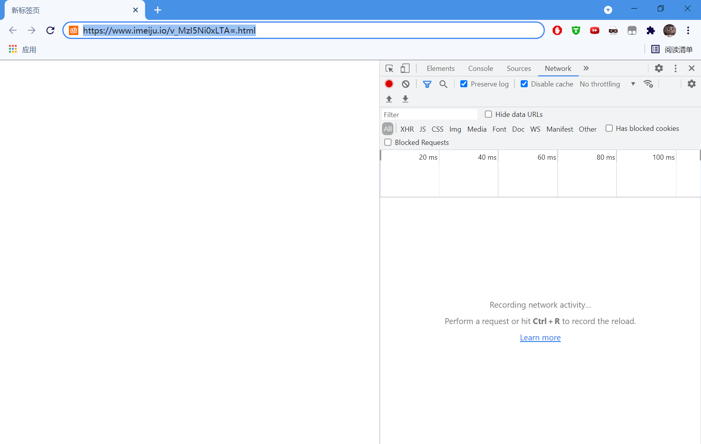

# (技术干货)如何下载网站上的视频  
本文将介绍一些网站上的视频的爬取方法，只涉及技术讨论，不提倡盗视频和侵犯版权等行为  
使用环境为Chrome浏览器，Edge、360、QQ等套壳Chromium浏览器类似，FireFox也差不多  

## 目录：
1. [万能方法](#万能方法)
2. [简单爬虫](#简单爬虫)
3. [高阶爬虫](#高阶爬虫)
4. [缓存法](#缓存法)
5. [总结](#总结)

## 万能方法  
**录屏**  
录屏永远是最万能的，但是受局限于画质、帧率、和时间。  

## 简单爬取  
这种方法一般可以爬取几分钟内的短视频  
以微信公众号内嵌视频为例，[地址](https://mp.weixin.qq.com/s/3efQ9ypOlN7ODJLz_KQL2w)  
点击播放视频，视频开始播放就可以暂停。右键点击视频，选择检查(或叫开发者……、网页检索……)，如果没出现选项，就按F12键。然后按Ctrl+F打开搜索框，输入 &lt;video ,然后按回车就会搜索网页内所有视频元素。如果出现多个视频，把光标移动到对应的标签，对应的视频就会高亮。然后查看我们想要的视频的&lt;video&gt;标签内容:  

```
<video class="video_fill" webkit-playsinline="isiPhoneShowPlaysinline" playsinline="isiPhoneShowPlaysinline" origin_src="http://mpvideo.qpic.cn/0b786uabqaaa5iajlqu6bjqfb5oddd2qagaa.f10002.mp4?dis_k=f906c06ff946a5fea1ef11469bbbdffc&amp;dis_t=1622619176&amp;spec_id=MzA5NTgxNTQzMA%3D%3D1622619242&amp;vid=wxv_1869171124429701126&amp;format_id=10002" src="http://mpvideo.qpic.cn/0b786uabqaaa5iajlqu6bjqfb5oddd2qagaa.f10002.mp4?dis_k=f906c06ff946a5fea1ef11469bbbdffc&amp;dis_t=1622619176&amp;spec_id=MzA5NTgxNTQzMA%3D%3D1622619242&amp;vid=wxv_1869171124429701126&amp;format_id=10002&amp;support_redirect=1&amp;mmversion=false" preload="metadata">                     您的浏览器不支持 video 标签                </video>
```  
标签的内容千变万化，但是我们需要的是src后面双引号包住的东西，即  
```
src="http://mpvideo.qpic.cn/0b786uabqaaa5iajlqu6bjqfb5oddd2qagaa.f10002.mp4?dis_k=f906c06ff946a5fea1ef11469bbbdffc&amp;dis_t=1622619176&amp;spec_id=MzA5NTgxNTQzMA%3D%3D1622619242&amp;vid=wxv_1869171124429701126&amp;format_id=10002&amp;support_redirect=1&amp;mmversion=false"
```  
这就是我们想要的视频的源地址，chrome打开这个地址，点击视频右下角的三个点按钮，就出现下载选项。至此简单爬取就完成了。  


## 高阶爬取  
这个方法适用于小型视频网站，这类网站并没有对视频进行保护。对于腾讯、爱奇艺、优酷等平台，这个方法依然不能用。  
以下面这个网页为例:[imeiju](https://www.imeiju.io/v_MzI5Ni0xLTA=.html)  
首先用上面简单爬取方法，得到视频的源地址，发现是这样的：  
```
src="blob:https://www.imeiju.io/98dcd5a3-dfb0-4759-bc05-e20b61cfe9f6"
```
跳转到https那个网址，一般情况下出现404。因为视频被分段，解析不到完整视频的源地址，但是浏览器会受到一个全部视频段落的名单，里面包括视频段落的地址和信息。所以操作方法是这样的:  
chrome新建一个空白标签页，按F12打开开发者视图，选择NetWork标签，最好选中以下这两个选项，Chrome输入网页地址，然后回车跳转  
  
点击播放视频，查看开发者视图NetWork标签，发现网页一直在下载文件，这就是视频分段文件，大部分情况下后缀是.ts，这里是.image，但是问题不大。在Filter（过滤器）内输入 **.m3u8** ，然后过滤得到几个后缀为m3u8的文件，逐个点进去查看Preview，发现一个文件长的比较像  
  
可以把其中一段下载下来验证一下，正确的话这个就是分段视频的清单。然后复制这个m3u8文件的地址  
  
打开[M3U8 Downloader](https://dl.pconline.com.cn/download/2343818-1.html)，把M3U8文件地址复制进去，文件名、下载路径自选，文件类型选MP4，然后点击下载，等待下载完毕。软件会自动将分段视频全部下载并且合成为一个视频。  
  


## 缓存法
理论上这个方法能够突破会员视频、代理等复杂限制下载视频，但是问题在于如何找到缓存。在这里只提供一个思路，在Chrome操作方法十分复杂，不作教学。  
但是缓存法不止能够用在Chrome上，在安卓手机上，一些软件在观看视频后直接把文件缓存在本地而不加密，可以比较容易找到缓存从而得到视频文件。  

## 总结  
本文介绍了4个方法，如果需要下载腾讯、爱奇艺、优酷等平台的视频，上Github搜索对应关键词，一般情况是存在正在维护的视频下载脚本的(因为语言五花八门，问题在于会不会使用)。  
